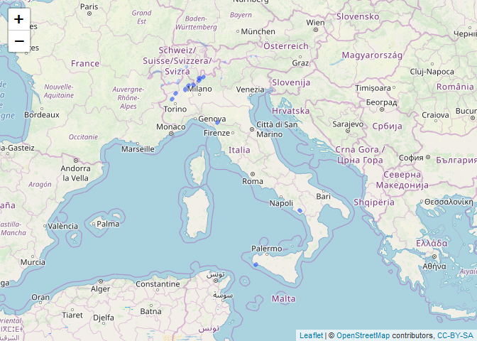
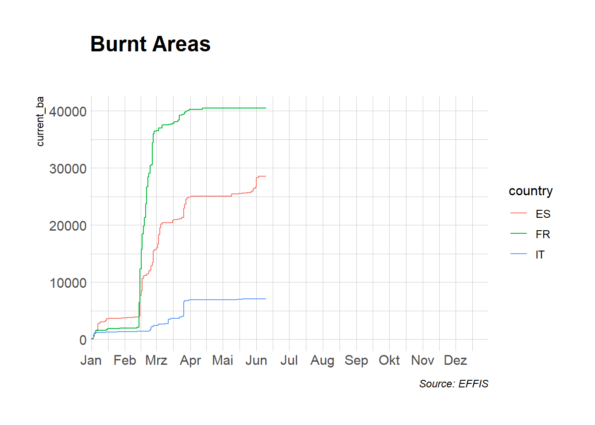
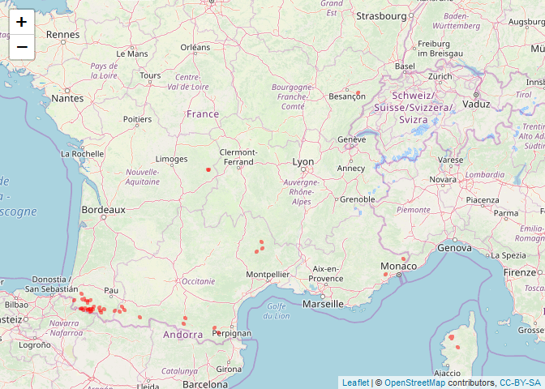
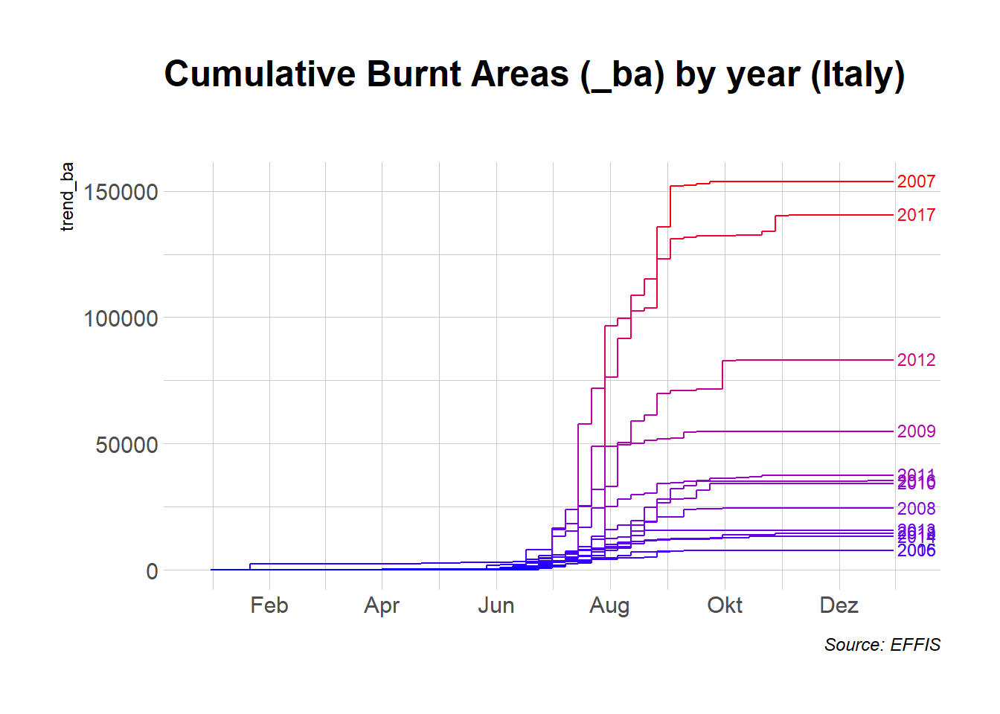
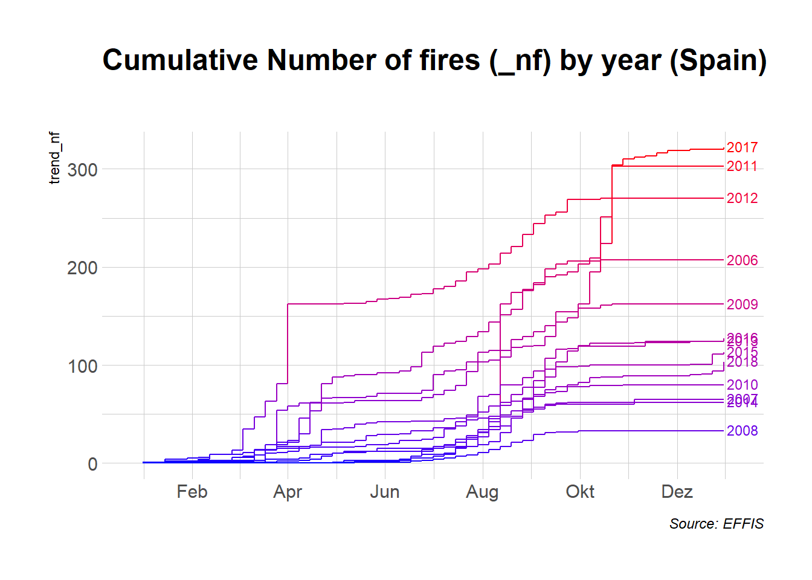

effisr
================

[](http://www.repostatus.org/#concept)
[](https://travis-ci.org/patperu/effisr)

### Libraries

``` r

library(effisr)
library(dplyr)
library(sf)
library(ggplot2)
library(hrbrthemes) # not 100% necessary
library(leaflet)
```

### Current

``` r

x <- ef_current(country = "IT", limit = 250, ordering = "-firedate")
glimpse(x)
## Observations: 51
## Variables: 24
## $ objectid         <int> 1051589, 1051387, 1051750, 1051759, 1050902, ...
## $ id               <int> 39728, 40001, 39703, 37776, 34929, 34884, 348...
## $ countryful       <chr> "Italy", "Italy", "Italy", "Italy", "Italy", ...
## $ province         <chr> "Trapani", "Trapani", "Verbano-Cusio-Ossola",...
## $ commune          <chr> "Campobello di Mazara", "Campobello di Mazara...
## $ firedate         <date> 2019-05-19, 2019-05-19, 2019-05-14, 2019-04-...
## $ area_ha          <int> 69, 24, 26, 55, 31, 29, 83, 119, 33, 372, 190...
## $ broadlea         <dbl> 0.00, 0.00, 57.69, 10.91, 70.00, 0.00, 2.44, ...
## $ conifer          <dbl> 0, 0, 0, 0, 0, 0, 0, 0, 0, 0, 0, 0, 0, 0, 0, ...
## $ mixed            <dbl> 0.00, 0.00, 42.31, 0.00, 0.00, 0.00, 0.00, 10...
## $ scleroph         <dbl> 0.00, 95.65, 0.00, 0.00, 0.00, 0.00, 0.00, 0....
## $ transit          <dbl> 0.00, 0.00, 0.00, 0.00, 0.00, 0.00, 0.00, 0.0...
## $ othernatlc       <dbl> 100.00, 0.00, 0.00, 89.09, 30.00, 100.00, 97....
## $ agriareas        <dbl> 0.00, 4.35, 0.00, 0.00, 0.00, 0.00, 0.00, 0.0...
## $ artifsurf        <dbl> 0.00, 0.00, 0.00, 0.00, 0.00, 0.00, 0.00, 0.0...
## $ otherlc          <dbl> 0, 0, 0, 0, 0, 0, 0, 0, 0, 0, 0, 0, 0, 0, 0, ...
## $ percna2k         <dbl> 85.07, 0.00, 79.78, 100.00, 0.00, 0.00, 0.00,...
## $ lastupdate       <date> 2019-05-21, 2019-05-21, 2019-05-15, 2019-04-...
## $ ba_class         <chr> "30DAYS", "30DAYS", "30DAYS", "ALL", "ALL", "...
## $ mic              <lgl> NA, NA, NA, NA, NA, NA, NA, NA, NA, NA, NA, N...
## $ se_anno_cad_data <lgl> NA, NA, NA, NA, NA, NA, NA, NA, NA, NA, NA, N...
## $ critech          <lgl> NA, NA, NA, NA, NA, NA, NA, NA, NA, NA, NA, N...
## $ country          <chr> "IT", "IT", "IT", "IT", "IT", "IT", "IT", "IT...
## $ geometry         <POLYGON [°]> POLYGON ((12.685 37.59883, ..., POLYG...

leaflet(x) %>%
   addTiles() %>%
   addPolygons(label = ~area_ha)
```



### Trend

``` r

x <- purrr::map_df(list("IT", "FR", "ES"), ~{ef_trend(country = .x, decimate = 7)})
glimpse(x)
## Observations: 1,095
## Variables: 8
## $ country     <chr> "IT", "IT", "IT", "IT", "IT", "IT", "IT", "IT", "I...
## $ day         <date> 1976-01-01, 1976-01-02, 1976-01-03, 1976-01-04, 1...
## $ year_first  <int> 2008, 2008, 2008, 2008, 2008, 2008, 2008, 2008, 20...
## $ year_last   <int> 2018, 2018, 2018, 2018, 2018, 2018, 2018, 2018, 20...
## $ historic_nf <int> 0, 0, 0, 0, 0, 0, 0, 0, 0, 0, 0, 0, 0, 0, 0, 0, 0,...
## $ historic_ba <int> 0, 0, 0, 0, 0, 0, 0, 7, 7, 7, 7, 7, 7, 7, 7, 66, 2...
## $ current_nf  <dbl> 0, 0, 1, 2, 2, 2, 3, 3, 3, 3, 3, 3, 3, 5, 5, 5, 5,...
## $ current_ba  <dbl> 0, 0, 853, 1209, 1209, 1209, 1233, 1233, 1233, 123...

ggplot(x, aes(day, current_ba, group = country, color = country)) + 
      geom_step() + 
      scale_x_date(expand=c(0,1), date_labels = '%b', date_breaks = 'month') +
      labs(x=NULL,
           title="Burnt Areas",
           subtitle="",
           caption="Source: EFFIS") + 
      theme_ipsum()
```



### Fires

``` r

x <- ef_fires(country_iso2 = "FR")
glimpse(x)
## Observations: 100
## Variables: 11
## $ fireId         <int> 39069, 38121, 34886, 34887, 34885, 34937, 34576...
## $ metadata       <df[,5]> <data.frame[25 x 5]>
## $ detected       <dttm> 2019-04-21 22:00:00, 2019-04-11 22:00:00, 2019...
## $ updated        <dttm> 2019-05-05, 2019-04-24, 2019-04-01, 2019-03-31...
## $ area           <dbl> 24, 229, 184, 26, 82, 51, 47, 51, 76, 50, 119, ...
## $ country        <int> 79, 79, 79, 79, 79, 79, 79, 79, 79, 79, 79, 79,...
## $ adminSublevel1 <int> 517, 513, 516, 505, 516, 504, 523, 504, 515, 50...
## $ adminSublevel2 <int> 6958, 6941, 6953, 6907, 6953, 6905, 6981, 6905,...
## $ adminSublevel3 <int> 12835, 12782, 12812, 12645, 12812, 12638, 12917...
## $ adminSublevel4 <int> 20337, 19737, 20137, 18433, 20137, 18339, 21293...
## $ geometry       <POLYGON [°]> POLYGON ((7.080213 48.12815..., POLYGON...

leaflet(x) %>%
   addTiles() %>%
   addPolygons(label = ~area, col = "red", weight = 4)
```



### Cumulative

``` r

IT_cum <- ef_hcu("IT", 2006:2018)
glimpse(IT_cum)
## Observations: 689
## Variables: 5
## $ country  <chr> "IT", "IT", "IT", "IT", "IT", "IT", "IT", "IT", "IT",...
## $ year     <int> 2006, 2006, 2006, 2006, 2006, 2006, 2006, 2006, 2006,...
## $ date     <date> 1976-01-01, 1976-01-08, 1976-01-15, 1976-01-22, 1976...
## $ trend_nf <dbl> 0, 0, 0, 0, 0, 0, 0, 0, 0, 0, 0, 0, 0, 0, 0, 0, 0, 0,...
## $ trend_ba <dbl> 0, 0, 0, 0, 0, 0, 0, 0, 0, 0, 0, 0, 0, 0, 0, 0, 0, 0,...

ggplot(IT_cum, aes(date, trend_ba, group = year, colour = trend_ba)) +
        geom_step() +
        scale_x_date(expand=c(0, 25), date_labels = '%b', date_breaks = '2 months') +
        scale_color_gradient(low = 'blue', high = 'red') +
        geom_text(data = IT_cum[IT_cum$date=='1976-12-30',], 
                  aes(label=year), 
                  hjust = -0.1, 
                  vjust = 0.4, size = 3) +
        labs(x = NULL,
             title = "Cumulative Burnt Areas (_ba) by year (Italy)",
             color = "Year",
             subtitle = "",
             caption = "Source: EFFIS") +
        guides(colour = FALSE) +
        theme_ipsum()
```



``` r

ES_cum <- ef_hcu("ES", 2006:2018)
glimpse(ES_cum)
## Observations: 689
## Variables: 5
## $ country  <chr> "ES", "ES", "ES", "ES", "ES", "ES", "ES", "ES", "ES",...
## $ year     <int> 2006, 2006, 2006, 2006, 2006, 2006, 2006, 2006, 2006,...
## $ date     <date> 1976-01-01, 1976-01-08, 1976-01-15, 1976-01-22, 1976...
## $ trend_nf <dbl> 0, 0, 0, 0, 0, 0, 0, 0, 0, 0, 0, 0, 0, 0, 0, 0, 0, 0,...
## $ trend_ba <dbl> 0, 0, 0, 0, 0, 0, 0, 0, 0, 0, 0, 0, 0, 0, 0, 0, 0, 0,...

ggplot(ES_cum, aes(date, trend_nf, group = year, colour = trend_nf)) + 
        geom_step() +
        scale_x_date(expand=c(0, 25), date_labels = '%b', date_breaks = '2 months') +
        scale_color_gradient(low = 'blue', high = 'red') +
        geom_text(data = ES_cum[ES_cum$date=='1976-12-30',], 
                  aes(label=year), 
                  hjust = -0.1, 
                  vjust = 0.4, size = 3) +
        labs(x = NULL,
             title = "Cumulative Number of fires (_nf) by year (Spain)",
             color = "Year",
             subtitle = "",
             caption = "Source: EFFIS") +
        guides(colour = FALSE) +
        theme_ipsum()
```



Please note that this project is released with a [Contributor Code of
Conduct](CONDUCT.md). By participating in this project you agree to
abide by its terms.
