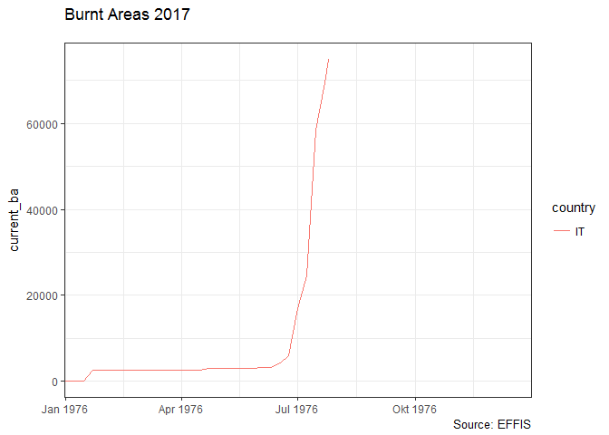

<!-- README.md is generated from README.Rmd. Please edit that file -->
[](http://www.repostatus.org/#concept) [](https://travis-ci.org/patperu/effisr)

effisr
======

Example
-------

This is a basic example which shows you how to solve a common problem:

``` r
library(effisr)
library(sf)
```

    ## Linking to GEOS 3.6.1, GDAL 2.2.0, proj.4 4.9.3

``` r
res <- ef_current(country = "IT", limit = 500)
dplyr::glimpse(res$docs)
```

    ## Observations: 340
    ## Variables: 26
    ## $ objectid         <int> 315903, 316024, 315677, 315995, 316079, 31599...
    ## $ id               <int> 168580, 168534, 163740, 167251, 168573, 16406...
    ## $ countryful       <chr> "Italy", "Italy", "Italy", "Italy", "Italy", ...
    ## $ province         <chr> "Latina", "Cosenza", "Olbia-Tempio", "Cosenza...
    ## $ commune          <chr> "Monte San Biagio", "Grisolia", "Ala dei Sard...
    ## $ firedate         <date> 2017-07-18, 2017-06-22, 2017-07-12, 2017-07-...
    ## $ area_ha          <int> 74, 431, 1830, 643, 564, 518, 472, 409, 341, ...
    ## $ broadlea         <dbl> 36.99, 0.69, 0.54, 3.27, 30.58, 4.61, 80.97, ...
    ## $ conifer          <dbl> 0.00, 0.00, 14.04, 0.00, 0.00, 7.68, 0.00, 25...
    ## $ mixed            <dbl> 0.00, 0.00, 0.00, 13.40, 0.00, 0.00, 0.00, 1....
    ## $ scleroph         <dbl> 61.64, 0.00, 79.37, 14.17, 0.00, 31.67, 0.00,...
    ## $ transit          <dbl> 0.00, 21.33, 0.00, 0.00, 14.24, 11.71, 6.34, ...
    ## $ othernatlc       <dbl> 0.00, 9.40, 0.98, 66.98, 0.00, 44.15, 12.68, ...
    ## $ agriareas        <dbl> 1.37, 63.99, 5.06, 2.18, 55.01, 0.19, 0.00, 4...
    ## $ artifsurf        <dbl> 0.00, 4.59, 0.00, 0.00, 0.18, 0.00, 0.00, 0.4...
    ## $ otherlc          <dbl> 0, 0, 0, 0, 0, 0, 0, 0, 0, 0, 0, 0, 0, 0, 0, ...
    ## $ percna2k         <dbl> 100.00, 0.00, 0.00, 90.09, 0.00, 8.85, 100.00...
    ## $ lastupdate       <date> 2017-07-21, 2017-07-20, 2017-07-19, 2017-07-...
    ## $ ba_class         <chr> "07DAYS", "07DAYS", "07DAYS", "07DAYS", "07DA...
    ## $ mic              <chr> NA, "YES", "YES", "YES", "YES", "YES", "YES",...
    ## $ se_anno_cad_data <chr> NA, NA, NA, NA, NA, NA, NA, NA, NA, NA, NA, N...
    ## $ critech          <chr> NA, NA, "YES", "YES", "YES", "YES", NA, NA, N...
    ## $ country          <chr> "IT", "IT", "IT", "IT", "IT", "IT", "IT", "IT...
    ## $ lon              <dbl> 13.297916, 15.845284, 9.384212, 15.832824, 15...
    ## $ lat              <dbl> 41.34202, 39.73190, 40.69381, 39.85083, 40.31...
    ## $ geo_shape        <simple_feature> POLYGON((13.304083358 41.34..., PO...

``` r
plot(res$docs$geo_shape)
```


``` r
x <- tibble::as_tibble(res$docs) %>%
     sf::st_as_sf(coords = c("lon", "lat")) %>% 
     sf::st_set_crs( 4326)
```

``` r
library(ggplot2)

x %>%
      ggplot() +
      geom_sf(aes(size = area_ha, geometry = geo_shape)) +
      ggtitle("Fire") +
      theme(legend.position="bottom") 
```


``` r
x <- ef_trend(country = "IT", decimate = 7)

dplyr::glimpse(x)
```

    ## Observations: 53
    ## Variables: 8
    ## $ country     <chr> "IT", "IT", "IT", "IT", "IT", "IT", "IT", "IT", "I...
    ## $ day         <date> 1976-01-01, 1976-01-08, 1976-01-15, 1976-01-22, 1...
    ## $ year_first  <int> 2008, 2008, 2008, 2008, 2008, 2008, 2008, 2008, 20...
    ## $ year_last   <int> 2016, 2016, 2016, 2016, 2016, 2016, 2016, 2016, 20...
    ## $ historic_nf <int> 0, 0, 0, 0, 0, 0, 0, 0, 0, 0, 0, 0, 0, 0, 0, 0, 0,...
    ## $ historic_ba <int> 0, 0, 0, 0, 0, 0, 0, 0, 0, 0, 21, 21, 21, 56, 56, ...
    ## $ current_nf  <dbl> 0, 1, 1, 5, 5, 5, 5, 5, 5, 5, 5, 6, 6, 6, 6, 7, 9,...
    ## $ current_ba  <dbl> 0, 84, 84, 2487, 2487, 2487, 2487, 2487, 2487, 248...

``` r
gg <- ggplot(x, aes(day, current_ba, group = country, color = country)) + geom_line()
gg <- gg + scale_x_date(expand=c(0,1), limits=range(x$day))
gg <- gg + labs(x=NULL,
                title="Burnt Areas 2017",
                subtitle="",
                caption="Source: EFFIS")
gg <- gg + theme_bw()
gg
```

    ## Warning: Removed 24 rows containing missing values (geom_path).



Fires
=====

``` r
x <- ef_fires(country = "IT", limit = 1000)
dplyr::glimpse(x)
```

    ## Observations: 350
    ## Variables: 12
    ## $ fireId         <int> 168580, 168534, 168252, 168250, 168251, 168255,...
    ## $ detected       <dttm> 2017-07-17 22:00:00, 2017-06-21 22:00:00, 2017...
    ## $ updated        <dttm> 2017-07-21, 2017-07-20, 2017-07-19, 2017-07-19...
    ## $ area           <dbl> 74, 431, 119, 79, 51, 274, 246, 142, 133, 118, ...
    ## $ country        <int> 112, 112, 112, 112, 112, 112, 112, 112, 112, 11...
    ## $ adminSublevel1 <int> 1349, 1345, 1349, 1349, 1342, 1346, 1345, 1345,...
    ## $ adminSublevel2 <int> 18839, 18816, 18839, 18841, 18804, 18822, 18816...
    ## $ adminSublevel3 <int> 46256, 44771, 46248, 46361, 44091, 45328, 44744...
    ## $ adminSublevel4 <lgl> NA, NA, NA, NA, NA, NA, NA, NA, NA, NA, NA, NA,...
    ## $ lon            <dbl> 13.297916, 15.845285, 13.454946, 12.092371, 13....
    ## $ lat            <dbl> 41.34202, 39.73190, 41.35442, 42.05303, 41.9402...
    ## $ country_iso2   <chr> "IT", "IT", "IT", "IT", "IT", "IT", "IT", "IT",...

Please note that this project is released with a [Contributor Code of Conduct](CONDUCT.md). By participating in this project you agree to abide by its terms.
