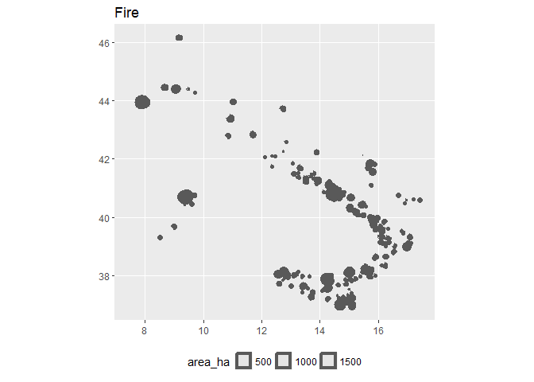

<!-- README.md is generated from README.Rmd. Please edit that file -->
[](https://travis-ci.org/patperu/effisr)

effisr
======

Example
-------

This is a basic example which shows you how to solve a common problem:

``` r
library(effisr)
library(sf)
```

    ## Linking to GEOS 3.6.1, GDAL 2.2.0, proj.4 4.9.3

``` r
res <- eff_search(country = "IT", limit = 250)
dplyr::glimpse(res$docs)
```

    ## Observations: 250
    ## Variables: 26
    ## $ objectid         <int> 313850, 313874, 313508, 313831, 313829, 31367...
    ## $ id               <int> 168534, 168532, 163740, 167251, 164061, 16661...
    ## $ countryful       <chr> "Italy", "Italy", "Italy", "Italy", "Italy", ...
    ## $ province         <chr> "Cosenza", "Salerno", "Olbia-Tempio", "Cosenz...
    ## $ commune          <chr> "Grisolia", "San Giovanni a Piro", "Ala dei S...
    ## $ firedate         <date> 2017-06-22, 2017-05-18, 2017-07-12, 2017-07-...
    ## $ area_ha          <int> 431, 332, 1830, 643, 477, 472, 409, 320, 261,...
    ## $ broadlea         <dbl> 0.69, 24.85, 0.54, 3.27, 4.64, 80.97, 0.00, 6...
    ## $ conifer          <dbl> 0.00, 0.00, 14.04, 0.00, 8.44, 0.00, 25.18, 0...
    ## $ mixed            <dbl> 0.00, 0.00, 0.00, 13.40, 0.00, 0.00, 1.96, 0....
    ## $ scleroph         <dbl> 0.00, 43.71, 79.37, 14.17, 26.58, 0.00, 32.27...
    ## $ transit          <dbl> 21.33, 0.00, 0.00, 0.00, 12.87, 6.34, 9.29, 1...
    ## $ othernatlc       <dbl> 9.40, 0.00, 0.98, 66.98, 47.26, 12.68, 26.65,...
    ## $ agriareas        <dbl> 63.99, 28.44, 5.06, 2.18, 0.21, 0.00, 4.16, 0...
    ## $ artifsurf        <dbl> 4.59, 2.99, 0.00, 0.00, 0.00, 0.00, 0.49, 0.0...
    ## $ otherlc          <dbl> 0, 0, 0, 0, 0, 0, 0, 0, 0, 0, 0, 0, 0, 0, 0, ...
    ## $ percna2k         <dbl> 0.00, 4.15, 0.00, 90.09, 2.68, 100.00, 0.00, ...
    ## $ lastupdate       <date> 2017-07-20, 2017-07-20, 2017-07-19, 2017-07-...
    ## $ ba_class         <chr> "07DAYS", "07DAYS", "07DAYS", "07DAYS", "07DA...
    ## $ mic              <chr> "YES", "YES", "YES", "YES", "YES", "YES", "YE...
    ## $ se_anno_cad_data <chr> NA, NA, NA, NA, NA, NA, NA, NA, NA, NA, NA, N...
    ## $ critech          <chr> NA, NA, "YES", "YES", NA, NA, NA, NA, NA, NA,...
    ## $ country          <chr> "IT", "IT", "IT", "IT", "IT", "IT", "IT", "IT...
    ## $ lon              <dbl> 15.845284, 15.492216, 9.384212, 15.832824, 15...
    ## $ lat              <dbl> 39.73190, 40.07855, 40.69381, 39.85083, 39.95...
    ## $ geom             <simple_feature> POLYGON((15.859537145 39.72..., PO...

``` r
plot(res$docs$geom)
```


``` r
x <- tibble::as_tibble(res$docs) %>%
     sf::st_as_sf(coords = c("lon", "lat"))
```

``` r
library(ggplot2)

x %>%
      ggplot() +
      geom_sf(aes(fill = area_ha)) +
      ggtitle("Fire") +
      theme(legend.position="bottom")
```



Please note that this project is released with a [Contributor Code of Conduct](CONDUCT.md). By participating in this project you agree to abide by its terms.
