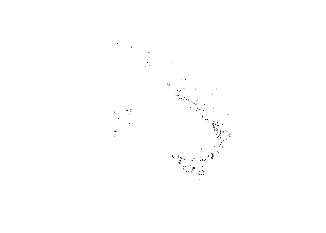

[](http://www.repostatus.org/#concept) [](https://travis-ci.org/patperu/effisr)

effisr
======

Current
-------

``` r

library(effisr)
library(sf)
#> Linking to GEOS 3.6.1, GDAL 2.2.0, proj.4 4.9.3

res <- ef_current(country = "IT", limit = 250, ordering = "-firedate")
res$docs <- sf::st_as_sf(res$docs, crs = 4326)

dplyr::glimpse(res$docs)
#> Observations: 250
#> Variables: 26
#> $ objectid         <int> 362767, 362770, 361621, 361636, 362769, 36162...
#> $ id               <int> 179464, 6083, 179092, 179471, 179466, 179093,...
#> $ countryful       <chr> "Italy", "Italy", "Italy", "Italy", "Italy", ...
#> $ province         <chr> "Potenza", "Catanzaro", "Potenza", "Siracusa"...
#> $ commune          <chr> "Avigliano", "Martirano Lombardo", "Pignola",...
#> $ firedate         <date> 2017-08-11, 2017-08-10, 2017-08-10, 2017-08-...
#> $ area_ha          <int> 100, 99, 182, 640, 142, 234, 121, 128, 40, 14...
#> $ broadlea         <dbl> 72.73, 0.00, 6.01, 28.19, 31.91, 3.83, 36.59,...
#> $ conifer          <dbl> 0.00, 0.00, 0.00, 0.00, 0.00, 0.85, 0.00, 12....
#> $ mixed            <dbl> 0.00, 0.00, 0.00, 0.00, 0.00, 0.00, 47.97, 5....
#> $ scleroph         <dbl> 0.00, 0.00, 0.00, 0.00, 0.00, 0.00, 0.00, 0.0...
#> $ transit          <dbl> 0.00, 43.00, 19.67, 0.00, 17.73, 13.62, 0.00,...
#> $ othernatlc       <dbl> 0.00, 45.00, 0.00, 71.18, 0.00, 81.70, 0.00, ...
#> $ agriareas        <dbl> 27.27, 6.00, 74.32, 0.62, 50.35, 0.00, 15.45,...
#> $ artifsurf        <dbl> 0.00, 6.00, 0.00, 0.00, 0.00, 0.00, 0.00, 0.0...
#> $ otherlc          <dbl> 0, 0, 0, 0, 0, 0, 0, 0, 0, 0, 0, 0, 0, 0, 0, ...
#> $ percna2k         <dbl> 0.00, 0.00, 0.00, 19.63, 0.00, 0.00, 100.00, ...
#> $ lastupdate       <date> 2017-08-11, 2017-08-10, 2017-08-10, 2017-08-...
#> $ ba_class         <chr> "07DAYS", "07DAYS", "07DAYS", "07DAYS", "07DA...
#> $ mic              <chr> NA, NA, NA, "YES", NA, "YES", NA, NA, NA, NA,...
#> $ se_anno_cad_data <chr> NA, NA, NA, NA, NA, NA, NA, NA, NA, NA, NA, N...
#> $ critech          <chr> NA, NA, NA, "YES", NA, NA, NA, NA, NA, NA, NA...
#> $ country          <chr> "IT", "IT", "IT", "IT", "IT", "IT", "IT", "IT...
#> $ lon              <dbl> 15.81491, 16.19831, 15.82461, 15.06225, 16.07...
#> $ lat              <dbl> 40.79725, 39.06828, 40.59465, 37.22126, 39.66...
#> $ geo_shape        <simple_feature> POLYGON((15.812848002 40.79..., PO...

plot(res$docs$geo_shape)
```



``` r

library(ggplot2)

x <- res$docs

gg <- ggplot(x) +
      geom_sf(aes(color = area_ha,
                  size = area_ha, 
                  geometry = geo_shape)) +
      ggtitle("Fire") +
      theme(legend.position="bottom") 
gg
```


Leaflet
-------

``` r

library(leaflet)
library(leaflet.extras)

leaflet(dplyr::filter(x, province == "Palermo")) %>%
   addTiles() %>%
   addPolygons(label = ~area_ha, popup = ~area_ha)
```


Trend
-----

``` r

x <- ef_trend(country = c("IT", "FR", "ES"), decimate = 7)
dplyr::glimpse(x)
#> Observations: 162
#> Variables: 8
#> $ country     <chr> "IT", "IT", "IT", "IT", "IT", "IT", "IT", "IT", "I...
#> $ day         <date> 1976-01-01, 1976-01-08, 1976-01-15, 1976-01-22, 1...
#> $ year_first  <int> 2008, 2008, 2008, 2008, 2008, 2008, 2008, 2008, 20...
#> $ year_last   <int> 2016, 2016, 2016, 2016, 2016, 2016, 2016, 2016, 20...
#> $ historic_nf <int> 0, 0, 0, 0, 0, 0, 0, 0, 0, 0, 0, 0, 0, 0, 0, 0, 0,...
#> $ historic_ba <int> 0, 0, 0, 0, 0, 0, 0, 0, 0, 0, 21, 21, 21, 56, 56, ...
#> $ current_nf  <dbl> 0, 1, 1, 5, 5, 5, 5, 5, 5, 5, 5, 6, 6, 6, 6, 7, 9,...
#> $ current_ba  <dbl> 0, 84, 84, 2487, 2487, 2487, 2487, 2487, 2487, 248...

gg <- ggplot(x, aes(day, current_ba, group = country, color = country)) + geom_line()
gg <- gg + scale_x_date(expand=c(0,1), limits=range(x$day))
gg <- gg + labs(x=NULL,
                title="Burnt Areas 2017",
                subtitle="",
                caption="Source: EFFIS")
gg <- gg + theme_bw()
gg
```


Fires
-----

``` r

x <- ef_fires(country_iso2 =  c("IT", "ES"), limit = 10)
dplyr::glimpse(x)
#> List of 2
#>  $ :'data.frame':    10 obs. of  13 variables:
#>   ..$ fireId        : int [1:10] 179464 179471 179093 179461 178129 176852 179465 179463 175266 179092
#>   ..$ shape         :'data.frame':   10 obs. of  2 variables:
#>   .. ..$ type       : chr [1:10] "Polygon" "Polygon" "Polygon" "Polygon" ...
#>   .. ..$ coordinates:List of 10
#>   ..$ detected      : POSIXct[1:10], format: "2017-08-10 22:00:00" ...
#>   ..$ updated       : POSIXct[1:10], format: "2017-08-11" ...
#>   ..$ area          : num [1:10] 100 640 234 100 1379 ...
#>   ..$ country       : int [1:10] 112 112 112 112 112 112 112 112 112 112
#>   ..$ adminSublevel1: int [1:10] 1344 1356 1342 1346 1356 1342 1345 1346 1345 1344
#>   ..$ adminSublevel2: int [1:10] 18814 18889 18803 18824 18887 18804 18816 18821 18816 18814
#>   ..$ adminSublevel3: int [1:10] 44538 50628 43956 45470 50557 44080 44794 45167 44779 44594
#>   ..$ adminSublevel4: logi [1:10] NA NA NA NA NA NA ...
#>   ..$ lon           : num [1:10] 15.8 15.1 14.5 14.7 13.4 ...
#>   ..$ lat           : num [1:10] 40.8 37.2 41.9 40.7 37.8 ...
#>   ..$ country_iso2  : chr [1:10] "IT" "IT" "IT" "IT" ...
#>  $ :'data.frame':    10 obs. of  13 variables:
#>   ..$ fireId        : int [1:10] 179101 179420 179100 178154 175938 175890 175891 175935 175932 174621
#>   ..$ shape         :'data.frame':   10 obs. of  2 variables:
#>   .. ..$ type       : chr [1:10] "Polygon" "Polygon" "Polygon" "Polygon" ...
#>   .. ..$ coordinates:List of 10
#>   ..$ detected      : POSIXct[1:10], format: "2017-08-09 22:00:00" ...
#>   ..$ updated       : POSIXct[1:10], format: "2017-08-11" ...
#>   ..$ area          : num [1:10] 153 85 61 652 191 ...
#>   ..$ country       : int [1:10] 215 215 215 215 215 215 215 215 215 215
#>   ..$ adminSublevel1: int [1:10] 384 387 394 388 395 395 394 395 384 387
#>   ..$ adminSublevel2: int [1:10] 4718 4725 4749 4728 4752 4752 4749 4752 4716 4725
#>   ..$ adminSublevel3: int [1:10] 2022 2078 2271 2099 2285 2285 2269 2285 2014 2081
#>   ..$ adminSublevel4: int [1:10] 684 1885 7205 2755 7491 7489 7139 7505 545 2002
#>   ..$ lon           : num [1:10] -6.43 -2.25 -6.9 -5.06 -7.52 ...
#>   ..$ lat           : num [1:10] 37.7 40.5 39.7 40.4 41.9 ...
#>   ..$ country_iso2  : chr [1:10] "ES" "ES" "ES" "ES" ...
```

Cumulative
----------

``` r

IT_cum <- ef_hcu(2006:2016, "IT")
gg <- ggplot(IT_cum, aes(date, trend_ba, group = year, colour = factor(year))) + geom_line()
gg <- gg + labs(x=NULL,
                title="Cumulative Burnt Areas by year (Italy)",
                color = "Year",
                subtitle="",
                caption="Source: EFFIS")
gg <- gg + theme_bw()
gg
```


``` r

FR_cum <- ef_hcu(2006:2016, "FR")
gg <- ggplot(FR_cum, aes(date, trend_nf)) + geom_line(aes(group = year, colour = factor(year)))
gg <- gg + labs(x=NULL,
                title="Cumulative Number of fires by year (France)",
                color = "Year",
                subtitle="",
                caption="Source: EFFIS")
gg <- gg + theme_bw()
gg
```


Please note that this project is released with a [Contributor Code of Conduct](CONDUCT.md). By participating in this project you agree to abide by its terms.
