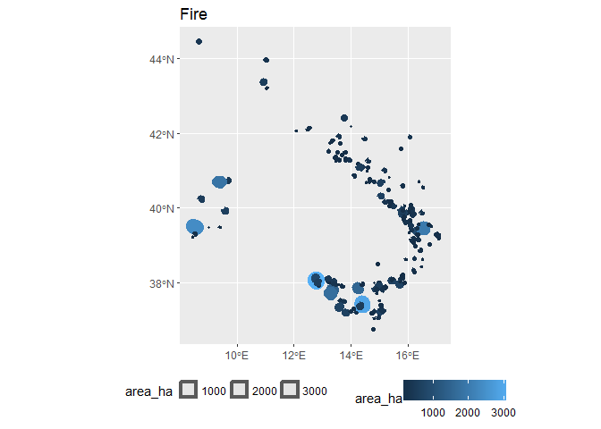

<!-- README.md is generated from README.Rmd. Please edit that file -->
[](http://www.repostatus.org/#concept) [](https://travis-ci.org/patperu/effisr)

effisr
======

Current
-------

``` r
library(effisr)
library(sf)
```

    ## Linking to GEOS 3.6.1, GDAL 2.2.0, proj.4 4.9.3

``` r
res <- ef_current(country = "IT", limit = 250, ordering = "-firedate")
dplyr::glimpse(res$docs)
```

    ## Observations: 250
    ## Variables: 26
    ## $ objectid         <int> 325459, 325421, 325476, 325462, 325434, 32543...
    ## $ id               <int> 169826, 170136, 170135, 169829, 169836, 17013...
    ## $ countryful       <chr> "Italy", "Italy", "Italy", "Italy", "Italy", ...
    ## $ province         <chr> "Nuoro", "Reggio di Calabria", "Catania", "Pa...
    ## $ commune          <chr> "Torpe", "Montebello Ionico", "Castiglione di...
    ## $ firedate         <date> 2017-07-25, 2017-07-24, 2017-07-24, 2017-07-...
    ## $ area_ha          <int> 104, 628, 89, 239, 266, 140, 46, 83, 62, 89, ...
    ## $ broadlea         <dbl> 0.00, 0.00, 0.00, 0.00, 0.00, 31.69, 0.00, 0....
    ## $ conifer          <dbl> 10.28, 0.00, 0.00, 0.00, 34.96, 0.00, 0.00, 0...
    ## $ mixed            <dbl> 0.00, 0.00, 0.00, 0.00, 0.00, 0.00, 0.00, 0.0...
    ## $ scleroph         <dbl> 89.72, 8.81, 34.07, 82.55, 0.00, 0.00, 0.00, ...
    ## $ transit          <dbl> 0.00, 0.00, 0.00, 0.00, 29.70, 0.00, 0.00, 0....
    ## $ othernatlc       <dbl> 0.00, 43.59, 65.93, 2.13, 28.95, 0.00, 97.83,...
    ## $ agriareas        <dbl> 0.00, 46.31, 0.00, 0.00, 6.39, 68.31, 2.17, 5...
    ## $ artifsurf        <dbl> 0.00, 1.28, 0.00, 15.32, 0.00, 0.00, 0.00, 0....
    ## $ otherlc          <dbl> 0, 0, 0, 0, 0, 0, 0, 0, 0, 0, 0, 0, 0, 0, 0, ...
    ## $ percna2k         <dbl> 0.00, 0.00, 100.00, 50.10, 88.17, 0.00, 47.67...
    ## $ lastupdate       <date> 2017-07-25, 2017-07-25, 2017-07-25, 2017-07-...
    ## $ ba_class         <chr> "07DAYS", "07DAYS", "07DAYS", "07DAYS", "07DA...
    ## $ mic              <chr> NA, "YES", NA, "YES", "YES", NA, NA, NA, NA, ...
    ## $ se_anno_cad_data <chr> NA, NA, NA, NA, NA, NA, NA, NA, NA, NA, NA, N...
    ## $ critech          <chr> NA, "YES", NA, NA, NA, NA, NA, NA, NA, NA, NA...
    ## $ country          <chr> "IT", "IT", "IT", "IT", "IT", "IT", "IT", "IT...
    ## $ lon              <dbl> 9.664751, 15.714852, 15.154927, 13.207316, 16...
    ## $ lat              <dbl> 40.61132, 37.96695, 37.87751, 38.10746, 41.89...
    ## $ geo_shape        <simple_feature> POLYGON((9.66045285299998 4..., PO...

``` r
plot(res$docs$geo_shape)
```


``` r
library(ggplot2)

x <- res$docs

gg <- ggplot(x) +
      geom_sf(aes(color = area_ha,
                  size = area_ha, 
                  geometry = geo_shape)) +
      ggtitle("Fire") +
      theme(legend.position="bottom") 
gg
```


Trend
-----

``` r
x <- ef_trend(country = c("IT", "FR", "ES"), decimate = 7)
dplyr::glimpse(x)
```

    ## Observations: 162
    ## Variables: 8
    ## $ country     <chr> "IT", "IT", "IT", "IT", "IT", "IT", "IT", "IT", "I...
    ## $ day         <date> 1976-01-01, 1976-01-08, 1976-01-15, 1976-01-22, 1...
    ## $ year_first  <int> 2008, 2008, 2008, 2008, 2008, 2008, 2008, 2008, 20...
    ## $ year_last   <int> 2016, 2016, 2016, 2016, 2016, 2016, 2016, 2016, 20...
    ## $ historic_nf <int> 0, 0, 0, 0, 0, 0, 0, 0, 0, 0, 0, 0, 0, 0, 0, 0, 0,...
    ## $ historic_ba <int> 0, 0, 0, 0, 0, 0, 0, 0, 0, 0, 21, 21, 21, 56, 56, ...
    ## $ current_nf  <dbl> 0, 1, 1, 5, 5, 5, 5, 5, 5, 5, 5, 6, 6, 6, 6, 7, 9,...
    ## $ current_ba  <dbl> 0, 84, 84, 2487, 2487, 2487, 2487, 2487, 2487, 248...

``` r
gg <- ggplot(x, aes(day, current_ba, group = country, color = country)) + geom_line()
gg <- gg + scale_x_date(expand=c(0,1), limits=range(x$day))
gg <- gg + labs(x=NULL,
                title="Burnt Areas 2017",
                subtitle="",
                caption="Source: EFFIS")
gg <- gg + theme_bw()
gg
```

    ## Warning: Removed 70 rows containing missing values (geom_path).



Fires
-----

``` r
x <- ef_fires(country_iso2 =  c("FR", "ES"), limit = 10)
dplyr::glimpse(x)
```

    ## Observations: 20
    ## Variables: 12
    ## $ fireId         <int> 170449, 170144, 169824, 169499, 169825, 169500,...
    ## $ detected       <dttm> 2017-07-25 22:00:00, 2017-07-24 22:00:00, 2017...
    ## $ updated        <dttm> 2017-07-26, 2017-07-26, 2017-07-26, 2017-07-26...
    ## $ area           <dbl> 1243, 87, 1424, 885, 643, 1890, 126, 154, 110, ...
    ## $ country        <int> 79, 79, 79, 79, 79, 79, 79, 79, 79, 79, 215, 21...
    ## $ adminSublevel1 <int> 523, 523, 523, 523, 523, 512, 515, 512, 523, 51...
    ## $ adminSublevel2 <int> 6985, 6982, 6985, 6986, 6985, 6940, 6951, 6939,...
    ## $ adminSublevel3 <int> 12929, 12919, 12927, 12930, 12928, 12778, 12807...
    ## $ adminSublevel4 <int> 21453, 21319, 21433, 21471, 21451, 19689, 20081...
    ## $ lon            <dbl> 6.317729, 7.194183, 5.811210, 5.617600, 6.62225...
    ## $ lat            <dbl> 43.11961, 43.78754, 43.55375, 43.68029, 43.1775...
    ## $ country_iso2   <chr> "FR", "FR", "FR", "FR", "FR", "FR", "FR", "FR",...

Please note that this project is released with a [Contributor Code of Conduct](CONDUCT.md). By participating in this project you agree to abide by its terms.
